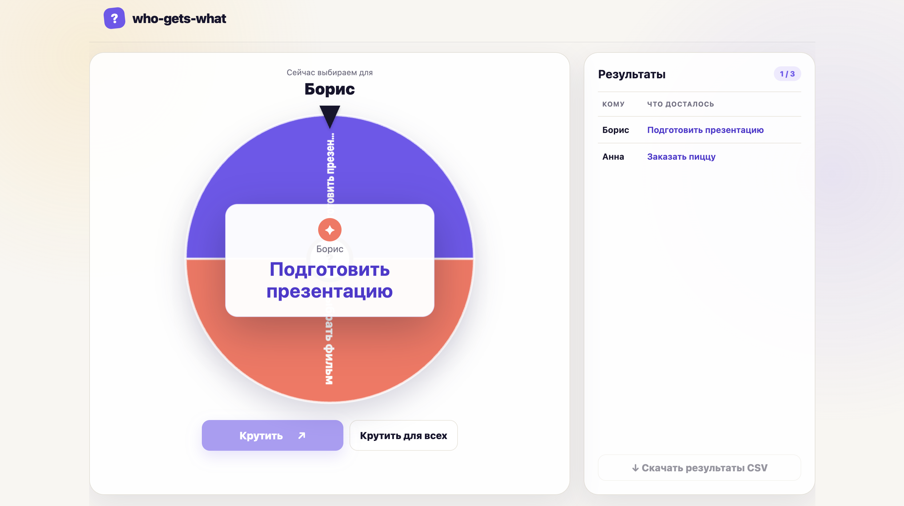

# who-gets-what

Локальный инструмент, который честно решает, кому что достанется. С его помощью можно раздать задачи, роли, подарки, места, темы или любые другие пункты списка. Работает как веб-приложение с колесом или напрямую из консоли.




## Веб-приложение

Нужен Go 1.27.1 или новее.

```bash
go run .
```

Откройте [http://localhost:6969](http://localhost:6969). В первом списке укажите имена, а во втором — то, что нужно между ними поделить. Можно крутить колесо вручную либо запустить автоматический выбор для всех. Готовый результат скачивается в CSV.

## Консольный режим

Подготовьте два текстовых файла, по одной записи на строку:

`participants.txt`:

```text
Анна
Борис
Вера
```

`variants.txt`:

```text
Подготовить презентацию
Заказать пиццу
Выбрать фильм
```

Получить CSV в терминале:

```bash
go run . -participants participants.txt -variants variants.txt
```

Сразу сохранить результат в файл:

```bash
go run . \
  -participants participants.txt \
  -variants variants.txt \
  -output results.csv
```

## Как всё распределяется

Результат для всех определяется заранее — колесо только показывает уже сделанный выбор и никак на него не влияет.

Пусть `P` — число людей, `V` — число пунктов во втором списке, `q = floor(P / V)`, а `r = P mod V`:

1. Каждый пункт добавляется в общий набор `q` раз.
2. `r` разных пунктов случайно получают ещё по одной копии.
3. Получившийся набор перемешивается алгоритмом Fisher–Yates.
4. Имена по порядку сопоставляются с перемешанными пунктами.

Для выбора и перемешивания используется криптографически безопасный `crypto/rand`. Поэтому:

- если пунктов больше, чем людей, ничего не повторяется;
- если их поровну, каждый пункт достаётся кому-то ровно один раз;
- если людей больше, пункты повторяются максимально равномерно — количество повторов отличается не более чем на один;
- до начала выбора у каждого человека одинаковая вероятность получить любой конкретный пункт: `1/V`.
